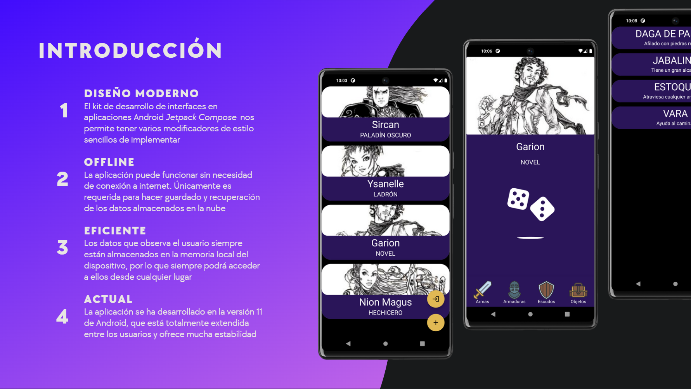
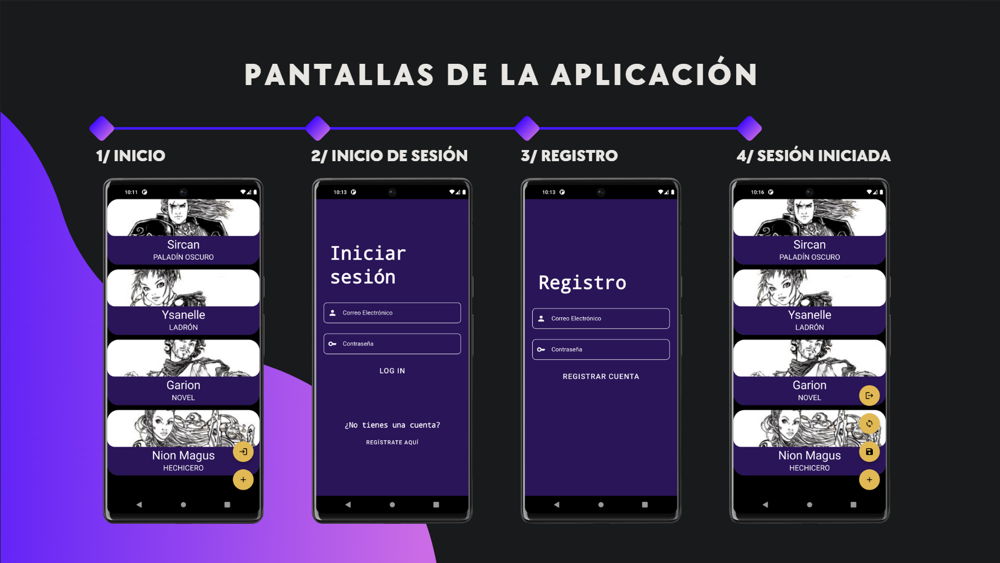
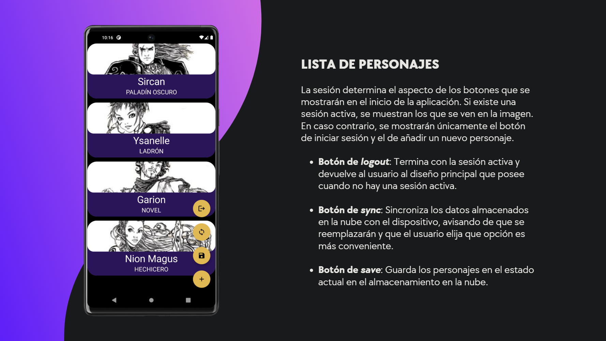
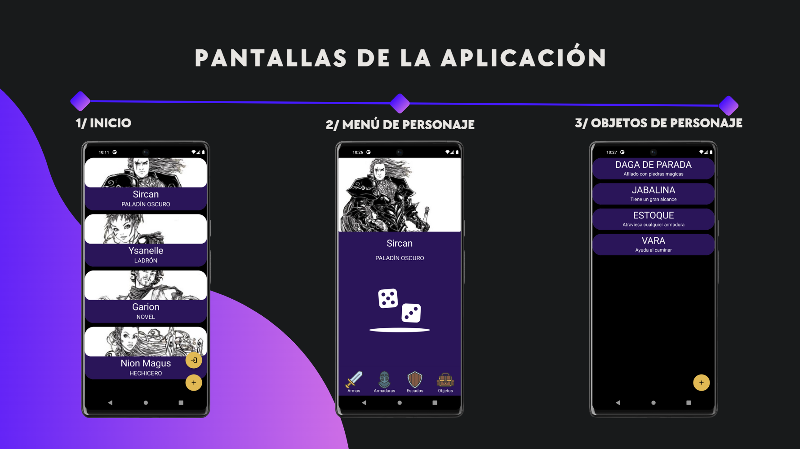
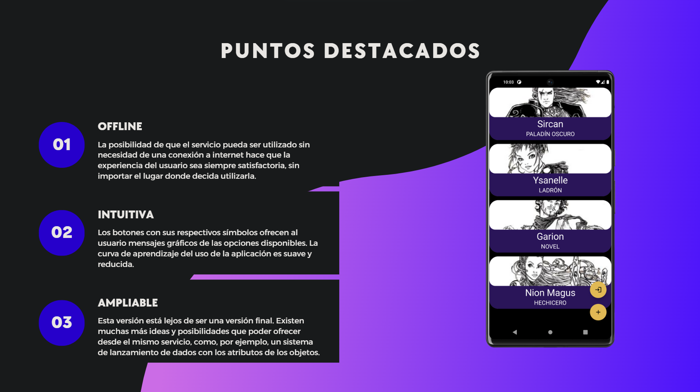

# CharDat – Gestor de Personajes de Anima: Beyond Fantasy

**CharDat** es una aplicación desarrollada en **Kotlin** para la gestión avanzada de personajes del juego de rol **Anima: Beyond Fantasy**.  
Su objetivo es ofrecer una experiencia moderna, ágil y visualmente atractiva que simplifique la creación, edición y almacenamiento de fichas de personaje, manteniendo la fidelidad a las reglas oficiales del sistema.

---

## 🧭 Pantallas principales

### Introducción

---

### Proceso de login/registro

---

### Funcionalidades disponibles

---

### Menú de personaje e inventario

---

### Puntos destacados

---

## ⚙️ Tecnologías utilizadas

| Tecnología | Función |
|-------------|----------|
| **Kotlin** | Lenguaje principal, orientado a objetos y funcional |
| **Jetpack Compose** | Framework declarativo para la UI |
| **Hilt (Dagger)** | Inyección de dependencias para controladores y repositorios |
| **Room** | Base de datos local y cacheo offline |
| **REST API + MongoDB** | Sincronización remota y almacenamiento centralizado |
| **Encryption Layer** | Cifrado de credenciales y datos sensibles |
| **Coroutines / Flow** | Gestión reactiva y asincronía eficiente |

---

## 🧩 Arquitectura

El proyecto sigue una arquitectura **MVVM (Model–View–ViewModel)** apoyada en los principios de **Clean Architecture**, separando de forma clara la lógica de dominio, presentación y datos.